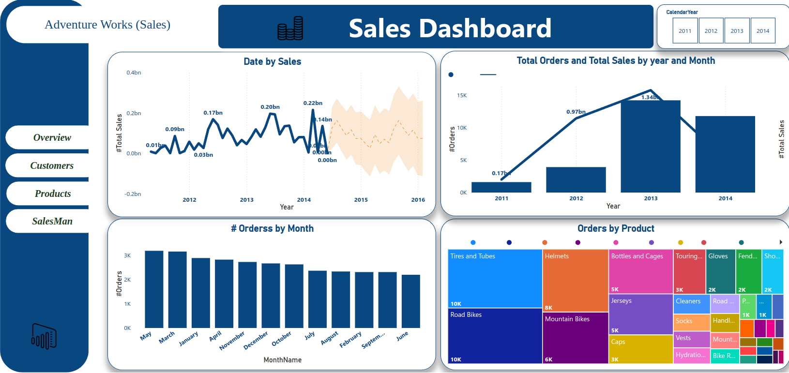
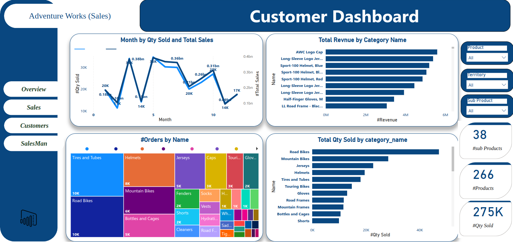
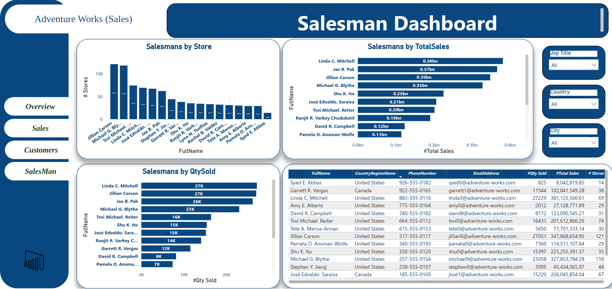
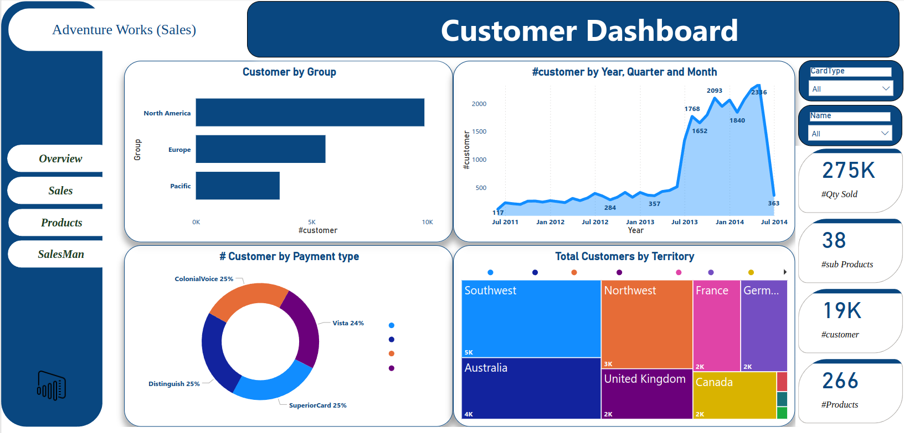

# AdventureWorks Project: ETL to Data Warehouse and Sales Dashboard

## 📋 Project Overview
This project involves extracting data from the **AdventureWorks** transactional database, transforming it into a structured format, loading it into a **Data Warehouse (DW)**, and creating an interactive **Sales Dashboard**. The primary goal is to demonstrate skills in ETL development, data modeling, and business intelligence visualization.

---

## 📊 Objectives
- **ETL Process**: Extract, transform, and load (ETL) data from AdventureWorks OLTP into a data warehouse.
- **Data Warehouse Design**: Implement a star schema for optimized reporting.
- **Sales Dashboard**: Build an interactive dashboard to visualize key sales metrics.

---

## 🛠️ Tools and Technologies
- **Database**: Microsoft SQL Server
- **ETL**: SQL Server Integration Services (SSIS)
- **Data Modeling**: Star Schema
- **Business Intelligence**: Power BI
- **Programming**: Python (for automation and integration where applicable)
- **Version Control**: Git and GitHub

---

## 📂 Project Workflow

### 1. **Data Extraction**
- Extract data from the **AdventureWorks OLTP** database tables:
  - `Sales.SalesOrderHeader`
  - `Sales.SalesOrderDetail`
  - `Production.Product`
  - `Person.Person`
  - `Sales.SalesTerritory`

### 2. **Data Transformation**
- Clean and standardize the data:
  - Convert non-unicode to unicode string types to ensure compatibility.
  - Handle null values and missing data.
- Apply business rules:
  - Calculate `Total Sales` as `Quantity * Unit Price`.
  - Add surrogate keys for dimensions.
- Design and populate dimension tables:
  - `DimProduct`, `DimCustomer`, `DimSalesTerritory`, etc.
- Create fact table:
  - `FactSales`.

### 3. **Data Loading**
- Load the transformed data into the **Data Warehouse (DW)**.

### 4. **Sales Dashboard**
- Design an interactive dashboard in **Power BI** to visualize:
  - **Total Revenue**.
  - **Sales by Product Category**.
  - **Sales by Territory**.
  - **Year-over-Year (YoY) Growth**.
  - **Top Customers**.








---

## 🗃️ Data Warehouse Schema

### **Star Schema Design**
- **Fact Table**:
  - `FactSales`:
    - `SalesOrderID`, `ProductKey`, `CustomerKey`, `TerritoryKey`, `OrderDate`, `TotalSales`, etc.
- **Dimension Tables**:
  - `DimProduct`:
    - `ProductKey`, `ProductName`, `Category`, `SubCategory`, etc.
  - `DimCustomer`:
    - `CustomerKey`, `FirstName`, `LastName`, `Region`, etc.
  - `DimSalesTerritory`:
    - `TerritoryKey`, `Region`, `Country`, etc.

---

## 🚀 How to Run the Project

### Prerequisites
- Microsoft SQL Server and AdventureWorks database installed.
- SSIS installed for ETL development.
- Power BI Desktop installed for dashboard creation.

### Steps
1. Clone this repository:
   ```bash
   git clone https://github.com/mohamed1kot/Sales_DW/blob/main
    ```
2. Open and run the AdventureWorks_ETL.dtsx package in SSIS to perform the ETL process.
3. Open the Power BI report file (Sales_Dashboard.pbix) to view and interact with the dashboard.

### 🤝 Contributing
- Contributions are welcome! Please fork this repository, make your changes, and submit a pull request.
---
### Authors

- <span style="color: blue;">Sophy Farag</span> 
- <span style="color: orange;">Abdelrahman Salah</span> 
- <span style="color: orange;">Mohamed Sayed</span> 
- <span style="color: orange;">Mohamed Amged</span> 
